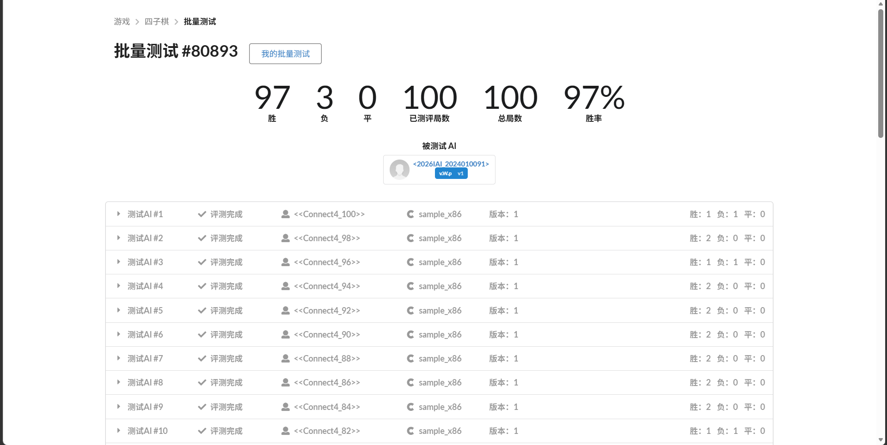

# Connect Four 实验报告

## 结果统计

由于对局包含随机模拟，结果有小幅波动，下面给出一次 `batch=50` 的批量测试结果（共 100 局）：

| 胜数 | 负数 | 平数 |
|---|---|---|
| 97 | 3 | 0 |



[测试链接](https://www.saiblo.net/batch/80893/)

## 方法概述

程序主要采用 **MCTS（蒙特卡洛树搜索）+ UCT（信心上限）** 算法   

首先是对于 **节点的估计**，对于每个局面 $s$ 的估计值定义为：

$$
Value(s) = \sum_{k = 1}^{Visits(s)} score_{k}
$$

- $Visits(s)$：局面 $s$ 的总模拟次数。
- $score_{k}$：第 $k$ 次模拟回传的分数，实验中 (胜, 负, 平) 分别对应 (1, 0, 0.5)


```C++
inline double scoreForPlayer(uint8_t player, int winner) {
   if (winner == 0) return 0.5;
   return (winner == player) ? 1.0 : 0.0;
}
```

对于**信心上限 (UCT)** 的计算，由于父节点和子节点对于收益的含义刚好相反，因此在计算时需要转换视角，用 $1 - Value(s)$ 表示对父节点来说子节点的收益

$$ 
UCT(s_{child})=\left (1 - \frac{Value(s_{child})}{Visits(s_{child})}\right) + UCT\_C\sqrt{\frac{\ln(Visits(s) + 1)}{Visits(s_{child})}}
$$

- $UCT\_C$：探索系数

另外，在本次实验中，由于决策点不单单是蒙特卡洛树产生，对于一些节点因为没有回传可能会出现 $Visits = 0$ 的情况  

可能出现的情况是搜索到制胜棋，或者其他未知情况，总体收益较高，因此默认设置为 $UCT = 1e50$，并且由于这只保证优先尝试一次，对于最终的胜利不会产生太大影响，从探索的角度来说也是合理的   

```C++
double log_n = log(static_cast<double>(node.visits + 1));
...
if (child.visits == 0) {
   s = 1e50;   // s 为最终 UCT 得分 score
} else {
   double mean = child.value / static_cast<double>(child.visits);
   double exploit = 1.0 - mean;    // 平均收益
   double explore = UCT_C * sqrt(log_n / static_cast<double>(child.visits));
   s = exploit + explore;
}
```

**蒙特卡洛搜索**过程：

1. 选择
   - 从当前局面 `root_state` 开始向下搜索
     - 若无可拓展节点，选择 UCT 最大的节点向下搜索
     - 直到叶节点，存在可拓展节点或决出胜负的节点
2. 拓展
   - 从未拓展节点中随机选取一个进行拓展，将其添加到搜索树中
3. 模拟
   - 从新节点处开始 rollout 直到终局
   - rollout 过程中每一步会按照 制胜 > 拦截 > 中心优先随机 的优先级进行随机落子
4. 回传
   - 对于搜索路径上的每一个节点进行回传
   - 按照模拟结果 (胜, 负, 平) 对应 (1, 0, 0.5) 向上更新 value 和访问次数 visits 

## 优化策略

### 结构压缩与内存优化

- 棋盘 `board` 用 `uint8_t` 表示，`top` 用 `int8_t` 表示
- 搜索节点 `Node` 采用固定数组储存子节点和未扩展节点，减少动态分配
- 搜索图 `Graph` 启动时预先开辟一个大数组 `reserve(MAX_NODE_POOL)`。

能够降低内存占用与分配开销，提高缓存命中率，从而提高搜索速度和深度

```C++
struct State {
   /*完整棋局状态*/
   int M, N;
   int noX, noY;
   uint8_t board[MAX_M][MAX_N];
   int8_t top[MAX_N];
   uint8_t toMove;    // 当前轮到谁下
};
```

此外，还想过使用位图来表示棋盘，但考虑到棋盘大小 [12, 12] 以及后续的实现与调试难度，选择折中的 8 位无符号整型

### 快速随机数

- 单独实现了 `FastRng` 用于快速产生随机数

由于 rollout 需要频繁产生随机数，随机数生成的常数级开销也会影响迭代轮数  

```C++
struct FastRng {
   uint64_t s;
   FastRng() {
      ...   // 利用时间戳初始化 s
   }
   inline int nextInt(int n) {
      /*返回 n 以内的一个随机数*/
      s ^= s << 7;
      s ^= s >> 9;
      if (n <= 1) return 0;
      return static_cast<int>(static_cast<uint32_t>(s) % static_cast<uint32_t>(n));
   }
};
```

### Zobrist 哈希去重

- 使用 `g_zobrist` 和 `g_misc` 计算局面哈希，`key_to_idx` 实现局面到节点的映射    

在调用棋类游戏的相关优化方法后发现此方法，利用随机生成的位串通过异或运算来唯一标识棋盘状态  
并结合置换表，来有效避免重复搜索，对棋类游戏程序的搜索速度有着巨大提升  

调研了 [A New Hashing Method with Application for Game Playing](https://research.cs.wisc.edu/techreports/1970/TR88.pdf)、The Effect of Hash Signature Collisions in a Chess Program 等经典论文，以及网上相关参考资料，完成实验中该部分代码的实现  

利用哈希得到的 key，将搜索树结构优化为搜索图，使得同一局面可由不同路径到达，提高搜索速度  
同时避免了重复创建子节点，在统计上也更加稳定，评估更合理

```C++
inline uint64_t hashState(State& st) {
   /*将 State 转成哈希值，用于判断是否搜索过*/
   uint64_t h = g_misc[0];
   h ^= // 融入 State 中的基本信息
   for (int c = 0; c < st.N; c++) {
      h ^= // 融入 top 信息
   }
   for (int i = 0; i < st.M; i++) {
      for (int j = 0; j < st.N; j++) {
         h ^= // 融入 board 信息
      }
   }
   return h;
}
```

- 在创建新节点时，通过先查哈希，命中直接复用子图

极大减少冗余搜索，提高固定时间内的有效样本数

```C++
inline int getOrCreateNode(Graph& g, State& st, bool terminal, int winner) {
   /*通过哈希值判断节点是否存在，存在直接复用，不存在则创建*/
   uint64_t key = hashState(st);
   unordered_map<uint64_t, int>::iterator it = g.key_to_idx.find(key);
   if (it != g.key_to_idx.end()) {
      Node& node = g.nodes[it->second];
      ...  // 其他调整
      return it->second;
   }
   return createNode(g, st, terminal, winner, key);
}
```

### 启发式 rollout

- 在模拟过程中加入 制胜 > 拦截 > 中心优先随机 的策略

从直观上来说，制胜和拦截棋的优先级显著高于其他，检测到时可以无脑下而省去模拟  
中心优先随机意味这棋盘的中心区域往往收益会更大，因为可选择区域更大，也能对对手产生更大的制约  
相比纯随机减少盲目性，能显著降低噪声，提高每次模拟质量

```C++
inline int rollout(State& st, FastRng& rng) {
    /*重复落子，直到终局，返回赢家*/
    while (1) {
        ...  // 获取相关信息
        if (win_count > 0) col = wins[rng.nextInt(win_count)];
        else if (threat_count > 0) col = threats[rng.nextInt(threat_count)];
        else if (legal_count > 0) col = legal[rng.nextInt(min(4, legal_count))];
        if (col < 0) return 0;
        int x = applyMove(st, col);
        if (checkWinAt(st, x, col, cur)) return cur;
    }
}
```

### 根节点战术过滤

- 在最终决策时加入一层 `chooseBestMove()`, 优先放回直接制胜的节点
- 然后按照 访问次数最多 > 胜率 的优先级，选出安全的，不会让对手直接制胜的下法，然后才是普通的，访问次数最多的节点
  
按照访问次数优先有效提高了节点的稳定性，防止出现模拟次数过少导致的结果不可靠  
避免了从访问 100 次胜率为 60% 与 访问 3次 胜率为 80% 中选择更不稳定的后者

### 搜索图复用

- 设置全局变量 `g_cache` 储存搜索图，如果新回合能在旧图中找到当前局面，直接将当前局面设为新根继续搜索
- 当节点过多时，使用 `extractSubgraph` 保留新根节点的子图

连续对局的相邻回合中，同源信息很多，复用能减少从零建树成本，大大提高搜索效率

```C++
inline void prepareCacheRoot(State& root_state) {
   /*将 root_state 作为根节点初始化 cache 或者设为根节点，cache 过大提取子图*/
   ... // 特殊情况处理
   uint64_t key = hashState(root_state);
   unordered_map<uint64_t, int>::iterator it = g_cache.graph.key_to_idx.find(key);
   if (it == g_cache.graph.key_to_idx.end()) {    // 如果不存在，则重新初始化
      resetCacheToState(root_state);
      return;
   }
   int new_root = it->second;    // 存在则复用
   if (static_cast<int>(g_cache.graph.nodes.size()) > (MAX_NODE_POOL * 7) / 10) {
      g_cache.graph = extractSubgraph(g_cache.graph, new_root);   // 过大提取子图
   } else {
      g_cache.graph.root = new_root;
   }
   g_cache.root_state = root_state;
}
```

## 调参与经验

| 参数 | 当前值 | 选择原因 |
|---|---|---|
| `TIME_LIMIT_MS` | 2850 | 接近 3s 上限，同时给函数收尾预留空间，防止超时 |
| `MAX_NODE_POOL` | 450000 | 最大搜索节点数，保证较大搜索容量，同时方便控制内存 |
| `MAX_PATH` | 160 | 搜索路径深度，由于一个棋局最多 12 * 12 = 144 步，直接保证覆盖即可 |
| `UCT_C` | 0.95 | 搜索偏好，由于收益用胜率体现，取值为[0, 1], 因此设置的比较小，反复实验后感觉 0.95 最佳 |

## 瓶颈与反思  

目前程序在与 90~100 间的测例对抗时，仍然会出现个别战败的情况，分析众多对局后发现己方由于 rollout 以及最后 chooseBestMove 的启发与偏好下表现得过于稳重，而缺少明显的进攻性，很难在较少的回合数内完成制胜，因此在对局中将战线托长，从而在不利局面中战败   

这是程序明显的瓶颈与缺陷，我尝试引入一些更有进攻性的策略，比如人类经验中的制造两个**活三**(包含 3 个己方棋子和 1 个空格的连续 4 格区域)，但这在检测制胜棋中已经有部分体现，如何制造**两个**在程序实现上也比较困难，尝试过从 connect 2 的情况下进行特殊搜索判断，许多尝试后发现还不如单纯采用蒙特卡洛的结果好  

猜想可能是没能做好稳定与进攻之间的平衡，或者扰乱了蒙特卡洛搜索的随机模拟等导致的结果  

但引入更多的策略以及如何实现一定是今后的优化方向