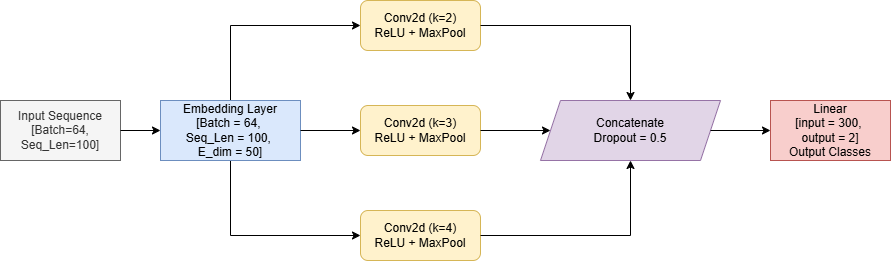
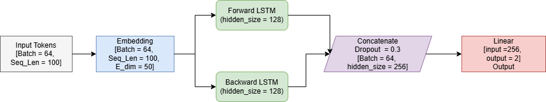
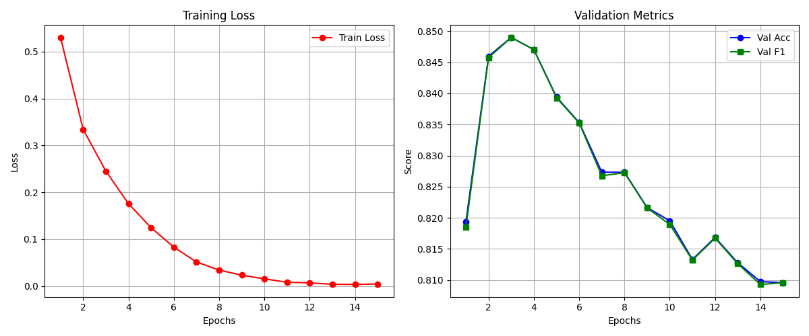
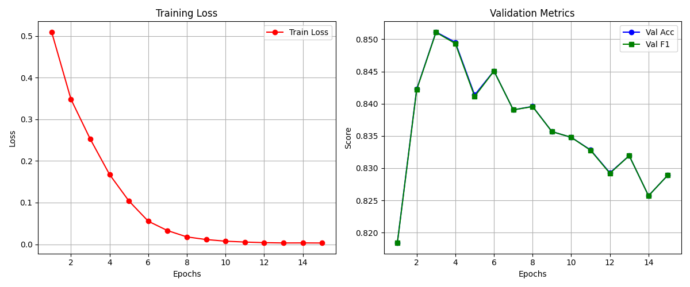
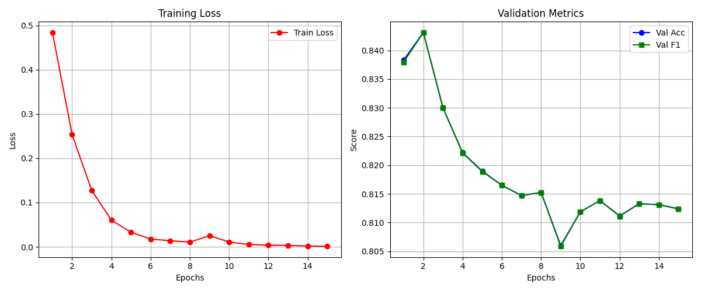
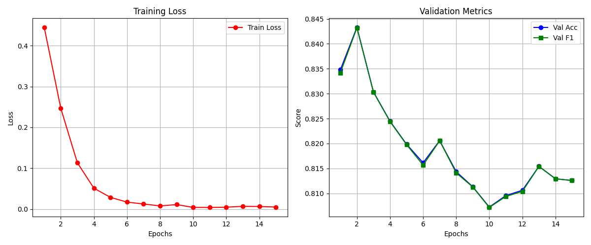
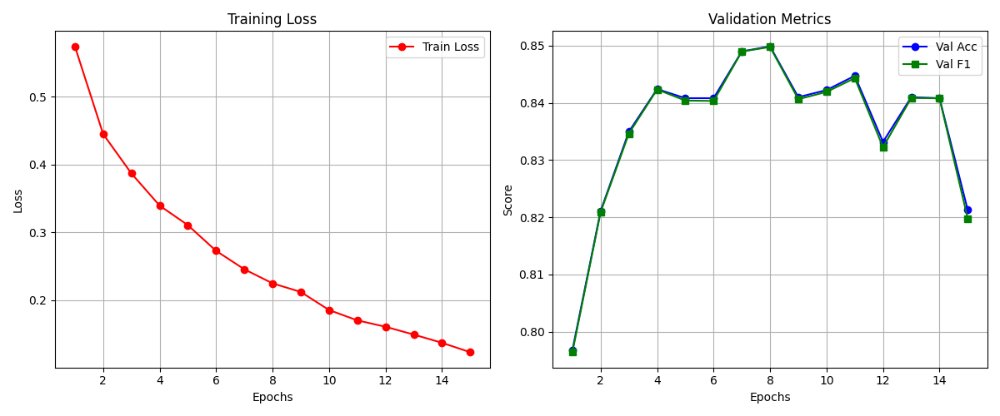

# 文本情感分类

王宇康 2024010091 计51  

## 模型结构图


<p align="center">CNN 结构</p>

1. 嵌入层
   - 将输入的单词索引转换为稠密的向量表示
2. 卷积层
   - 分别利用大小为 $2 * 50, 3 * 50, 4 * 50$ 的卷积核提取文本的$2-gram、3-gram$ 和 $4-gram$ 特征
   - 降低输入的维度
3. 池化层
   - 从每个卷积核生成的特征张量中提取最大值，也就是过滤整句话中情感色彩最强烈，最显著的特点
   - 将卷积后不同维度的输出统一为 $100 * 1$（本次实验中每种大小的卷积核用了 $100$ 个），保证后续全连接层的输入固定
4. Dropout 层
   - 训练过程中 dropout $50\%$ 的节点，防止模型过拟合
5. 全连接层
   - $300 * 2$ 的全连接网络，将 $300$ 个卷积池化后提取的特征，转化为 $2$ 种分类的原始得分


<p align="center">LSTM 结构</p>

1. 嵌入层
   - 作用同 CNN 中介绍，转为稠密向量表示
2. LSTM 层
   - 通过遗忘门，输入门，输出门，形成对输入文本语境的认知，记住前后的关联信息
   - 双向识别，同时对输入句子进行 从左到右 和 从右到左 的扫描，加强语境意识，使得在输出每个词时既有前文信息，也有后文信息
   - 堆叠多层 LSTM（实验中 $2$ 层），使模型可以学习更抽象，更多样的特征
3. Dropout 层
   - 训练过程中 dropout $30\%$ 的节点，防止模型过拟合
4. 全连接层
   - 将堆叠的 LSTM 输出（维度为 $hidden * 2 = 64 * 2$）作为输入，得到 $num\_classes = 2$ 中类别的原始分数

## 实验流程描述

### 数据预处理

**首先：**  设置 `TextPreprocs` 类，读入哈工大停词表 `hit_stopwords.txt`，读入提供的三个数据集 `test.txt`, `validation.txt`, `train.txt`，将文本和标签分别单独保存，并且为输入的文本设置一个最大长度 `max_len = 100` 和最低频率 `min_freq = 2`  

超过最大长度的文本将被直接截断，而低于最大长度将用 "\<PAD\>" 填补空缺，低于最低频率的词将会被识别为 "\<UNK\>"  

利用读入的文本建立一个映射表 `word_to_id` 和 `id_to_word`，从而将每一个词映射成单独的 `id`，转为数字，从而将每一个文本转成数字表示的张量存入到 `processed` 文件夹中供后面模型使用

**然后：**  在 `embed.py` 中读入 `wiki_word2vec_50.bin` 文件，利用 `word_to_id` 建立词汇库 vocabulary，利用这份映射生成 `embedding_matrix`，将前面得到的每一个词的数字 id 转为有语意的稠密向量 `embedding_matrix[idx] = w2v_model[word]`  

**最后：**  在 `data_loader.py` 中完成对数据的分批次处理，一次读入 `batch_size = 64` 的文本，方便后续的训练  

### 模型设置  

在 `models` 文件夹中配置好了不同模型，如 `mlp`, `cnn`, `rnn`，部分详细配置在前文模型结构图已经说明  

此外还实现了结合 `attention 机制的 LSTM 模型`，以及一个简单的 `transformer` 模型  

### 训练流程  

导入相应数据和模型配置后  

**首先：**  设置 `criterion = nn.CrossEntropyLoss()` 的交叉熵损失函数，用于评估模型效果  

设置 `optimizer = optim.Adam(model.parameters(), lr = config.LEARNING_RATE)` 的优化器，通过损失函数去反向优化模型参数  

**然后：**  开始训练，设置了一个固定训练轮次 `EPOCHS = 15`  
在每个轮次中读取 `train` 中的所有文本和标签，通过方向传播优化模型参数，完成后将模型导入评价函数 `evaluate`，利用 `validation` 中的数据进行验证，计算 `accuracy` 和 `f1_score` 等指标

**最后：**  保留在所有轮次中 `f1_score` 分数最高的模型参数

### 模型评估  

导入训练过程中保存的效果最好的模型参数，利用 `test` 中数据进行测试，并输出结果  

## 实验结果展示

此处展示所有实现模型的效果，方便后续 **模型比较** 部分的说明

### MLP


<p align="center">MLP 训练过程数据</p>

最终结果：
| Accuracy | Precision | Recall | F1-Score |
| -------- | --------- | ------ | -------- |
| 85.37% | 85.55% | 85.41% | 85.36% |


### CNN


<p align="center">CNN 训练过程数据</p>

最终结果：
| Accuracy | Precision | Recall | F1-Score |
| -------- | --------- | ------ | -------- |
| 85.64% | 85.74% | 85.67% | 85.63% |

### RNN(LSTM)


<p align="center">LSTM 训练过程数据</p>

最终结果：
| Accuracy | Precision | Recall | F1-Score |
| -------- | --------- | ------ | -------- |
| 84.55% | 85.16% | 84.64% | 84.51% |

### LSTM with Attention


<p align="center">LSTM with Attention 训练过程数据</p>

最终结果：
| Accuracy | Precision | Recall | F1-Score |
| -------- | --------- | ------ | -------- |
| 85.91% | 85.92% | 85.92% | 85.91% |

### Transformer  


<p align="center">Transformer 训练过程数据</p>

最终结果：
| Accuracy | Precision | Recall | F1-Score |
| -------- | --------- | ------ | -------- |
| 84.82% | 85.00% | 84.87% | 84.81% |

## 参数对比分析

此处仅对 CNN 和 RNN 的各项参数进行对比说明  

### CNN 

```python
arguments: {
   'learning_rate': [1e-4, 5e-4, 1e-3, 5e-3], 
   'batch_size': [16, 32, 64, 128], 
   'dropout': [0.2, 0.3, 0.4, 0.5, 0.6], 
   'num_filters': [50, 75, 100, 150], 
   'filter_sizes': [[2, 3, 4], [3, 4, 5]]
}
```

注意：采用控制变量法进行调参，此时其他参数默认为最佳情况

#### LEARNING_RATE

| learning_rate | test_accuracy | test_fscore |
| --- | --- | --- |
| 1e-4 | 82.11% | 82.08% |
| 5e-4 | 84.55% | 84.54% |
| 1e-3 | 85.64% | 85.63% |
| 5e-3 | 84.82% | 84.77% |

**原因分析：**    

- learning_rate 决定了模型反向传播梯度优化的步长
- 如果 learning_rate 过大，模型容易跨过最优解，造成 loss 函数震荡甚至梯度爆炸
- 而 learning_rate 过小则容易造成模型卡在局部最优，导致整体性能不足

#### BATCH_SIZE

| batch_size | test_accuracy | test_fscore |
| --- | --- | --- |
| 16 | 85.64% | 85.64% |
| 32 | 85.37% | 85.36% |
| 64 | 86.18% | 86.16% |
| 128 | 85.64% | 85.63% |

**原因分析：**   

- batch_size 决定每次更新梯度时读入的样本数量
- 每次读入大数量的数据时，模型更容易抓住梯度优化的方向，加快模型的收敛速度，但容易导致局部最优，削弱模型的泛化能力
- 而 batch_size 小时能提高模型泛化能力，但于此同时也容易学习一些不必要的噪声
- 但总体上看，对模型的影响较小

#### DROPOUT

| dropout | test_accuracy | test_fscore |
| --- | --- | --- |
| 0.2 | 85.37% | 85.35% |
| 0.3 | 86.99% | 86.99% |
| 0.4 | 85.64% | 85.64% |
| 0.5 | 86.45% | 86.44% |
| 0.6 | 84.28% | 84.28% |

**原因分析：**  

- dropout 用于防止模型过于依赖某几个节点，因此过小的 dropout 会导致模型产生严重的过拟合问题
- 而 dropout 过高，会导致模型在训练过程中没有足够的信息来学习复杂的特征组合，学习过于分散，导致性能下降

#### 卷积核数量

| num_filters | test_accuracy | test_fscore |
| --- | --- | --- |
| 50 | 85.09% | 85.07% |
| 75 | 85.64% | 85.63% |
| 100 | 86.45% | 86.45% |
| 150 | 85.91% | 85.90% |

**原因分析：**

- 卷积核数量表示对同一个样本提取的特征层数，同样过低和过高都会造成模型性能下降，过低会提取的特征较少，模型能用于学习的信息就更少，使得无法识别出一些更加隐晦的信息，但是提取过多特征同样会有很多不必要的噪声

#### 卷积核大小

| filter_size | test_accuracy | test_fscore |
| --- | --- | --- |
| [2, 3, 4] | 85.37% | 85.35% |
| [3, 4, 5] | 84.82% | 84.78% |

**原因分析：**

- 在此次实验中，卷积核大小主要是看模型一次看几个字，选择 [2, 3, 4] 主要是基于字的 2, 3, 4 元模型，在文本较短时能够保证语意完整和语境完整

### RNN

```python
arguments: {
   'learning_rate': [1e-4, 5e-4, 1e-3, 5e-3], 
   'batch_size': [16, 32, 64, 128], 
   'dropout': [0.2, 0.3, 0.4, 0.5, 0.6], 
   'hidden_size': [32, 64, 128], 
   'num_layers': [1, 2], 
}
```

#### LEARNING_RATE

| learning_rate | test_accuracy | test_fscore |
| --- | --- | --- |
| 1e-4 | 81.30% | 81.25% |
| 5e-4 | 82.66% | 82.64% |
| 1e-3 | 85.09% | 85.09% |
| 5e-3 | 85.64% | 85.59% |

#### BATCH_SIZE

| batch_size | test_accuracy | test_fscore |
| --- | --- | --- |
| 16 | 83.74% | 83.68% |
| 32 | 84.55% | 84.49%|
| 64 | 85.18% | 85.16% |
| 128 | 84.82% | 84.81% |

#### DROPOUT

| dropout | test_accuracy | test_fscore |
| --- | --- | --- |
| 0.2 | 85.09% | 85.07% |
| 0.3 | 86.18% | 86.16% |
| 0.4 | 85.64% | 85.60% |
| 0.5 | 84.82% | 84.75% |
| 0.6 | 84.55% | 84.55% |

**原因分析：**

learning_rate, batch_size, dropout 的分析与 CNN 一致，不多赘述

#### 隐藏层层数 & 隐藏层大小

| num_layers | hidden_size | test_accuracy | test_fscore |
| --- | --- | --- | --- |
| 1 | 32 | 83.20% | 83.18% |
| 1 | 64 | 84.82% | 84.79% |
| 1 | 128 | 84.01% | 83.96% |
| 2 | 32 | 84.28% | 84.28%|
| 2 | 64 | 86.72% | 86.72% |
| 2 | 128 | 85.09% | 85.09% |

**原因分析：**  

- 提高 num_layers 和 hidden_size 同样是为了提高模型的特征提取能力以及增强前后记忆能力，过小容易欠拟合，当层数过大时传递过程中及其容易造成梯度爆炸，对于本次实验分析文本的简单任务，2 层就有很好的表现

## 模型对比

结合 **实验结果展示** 部分的结果分析  

**平均性能表现**     

$CNN \approx MLP \ge LSTM\ with\ Attention \gt Transformer \approx LSTM$  

本次实验的文本情感分类任务总体不算复杂，因此简单的模型如 MLP 和 CNN 就能表现出很好的效果  
并且 MLP 和 CNN 擅长提取局部特征，很适合这种短文本，仅靠部分情感色彩强烈，而无需长语境的词语就能推断出正确的答案，因此表现效果最好  

而对于 LSTM 来说，为了保存更长的语境，在读到后面的词语时尽管保留了前文的特征，但可能存在比较严重的稀释，反而不利于提取出强烈的情感特征，在加入 Attention 机制后效果变好，也是因为利用自注意力机制对重要的词语分配了更高的权重，所以有了性能上的提升  

Transformer 模型没有表现出很明显的优势，一方面是因为实现的模型比较简单，采用 3 层 2 头注意力的基础版本，并且训练数据量也不算大，所以最终效果不如其他，但比 LSTM 还是有明显提升  

**优缺点分析**  

1. MLP 在此次实验中本质是先将句子中所有词的词向量取平均，然后输入到全连接层，完成分类  
   - 优点在于参数少，训练速度快，并且由于结构简单，在小数据集上能表现出很强的泛化能力，不易过拟合
   - 缺点是会丢失词序，前后文等信息，不适合在大数据集上使用
2. CNN 利用卷积核先提取出重要特征，然后输入到全连接层完成分类
   - 优点是卷积核很好的提取了 2, 3, 4 元模型，能够捕捉到短文本中的各自情感信息，并且卷积操作可以多核计算，训练速度快
   - 但缺点也就是没有 RNN 的全局视野，仅在卷积核范围大小内的词，不能提取跨越整个文本的深层逻辑
3. RNN/LSTM （双向）从左往右（同时从右往左）读取文本，并将信息积累在隐藏状态中
   - 优点很明显是具有其他模型没有的词序保留核上下文理解
   - 缺点是会为了整合整句话的信息，容易导致情感色彩强烈和明显的信息被稀释，并且无法像 CNN 和 Transformer 等进行并行计算，训练速度慢
   - 在加上 Attention 机制后重要信息被稀释的缺陷得到一定程度上的改善，但与之相应的是计算开销更大了
4. Transformer 完全依靠 Attention 机制来捕捉词与词之间的关联
   - 优点是能捕捉句子中任意两个词之间的关联，能分析更加复杂的句法和语义，并且并行度极高，训练速度快
   - 缺点是 Transformer 没有像 CNN 知道词语的局部相邻信息和 RNN 知道词与的先后顺序信息等，需要通过训练来学习，因此需要更大的数据集

## 问题思考回答

1. **实验训练什么时候停止是最合适的？简要陈述你的实现方式，并试分析固定迭代次数与通过验证集调整等方法的优缺点**
   - 一般来说，当模型在验证集上的性能开始趋于平缓或下降时（如 loss 不再下降或者 accuracy/f1-score 不再上升时），就应该停止训练  
   - 本次实验我采用训练固定、足够 loss 收敛的轮次，仅保存历史最佳验证集 f1-score 的模型参数，训练结束后加载该模型用于测试集  
   - 采用固定的迭代次数主要优点是训练时间可控，操作简单，但缺点是 epoch 的设置也需要摸索，过小模型可能没有学习充分，出现欠拟合，而过大则容易将噪声也学习，导致过拟合，本次实验采用保存历史最佳版本，一定程度上避免以上问题  
   - 而通过验证集调整则是可以防止模型过拟合，在验证集表现最好的时候停止，同时可以避免算力的浪费

2. **实验参数的初始化是怎么做的？不同的方法适合哪些地方？（现有的初始化方法为零均值初始化，高斯分布初始化，正交初始化等）**
   - 实验的参数采用 pytorch 默认参数，一般为均匀分布 (He Uniform, Xavier Uniform)，而在 LSTM with Attention 中使用了高斯分布初始化
   - 零初始化方法，或者常数初始化只适合 bias 的初始化
     - 对于一般的权重网络，如果初始参数相同，会导致对称性失效问题，同一层的所有神经元在前向、反向传播时会输出相同的值，算出相同的梯度，导致多层神经网络退化为单层甚至单神经元
   - 高斯分布初始化适合相对较浅的网络或标准的全连接层
     - 因为存粹的随机高斯分布容易导致梯度消失或爆炸
     - 因此更常使用基于高斯分布的一些变体，如 Xavier 适合活函数为 Tanh 或 Sigmoid 的网络，He 适合ReLU 及其变体激活函数
   - 正交初始化适合 RNN 的隐藏层权重矩阵
     - 因为 RNN 在处理长文本时，同一个权重矩阵会被反复相乘，如果权重矩阵的特征值大于 1 或小于 1，反复相乘极易导致梯度爆炸或梯度消失，正交矩阵保证等距变换，能最大程度的缓解梯度问题

3. **过拟合是深度学习常见的问题，有什么方法可以方式训练过程陷入过拟合**
   - 早停机制：在第一个问题中有所体现，即选择验证效果不再提升时的模型即可
   - Dropout：在训练过程中随机使一些节点失效，避免网络对某些节点过于依赖
   - 减小模型复杂度：如果数据集较小，减少神经网络的层数、隐藏层的维度等
   - 正则化：在损失函数中加入 L1 或 L2 惩罚项，强迫模型学习到数值较小的权重分布

4. **试分析CNN，RNN，全连接神经网络（MLP）三者的优缺点**
   - 在 **模型对比** 部分已经做过详细说明

5. **训练得到的模型的鲁棒性如何？可以从网上另找一些/爬取一些小规模的数据（也可以自己写或者调大模型接口生成）来进行测试，并将结果和测试集上的结果进行比较**
   - 在 github 上下载了一份 [酒店评论数据](https://github.com/SophonPlus/ChineseNlpCorpus/blob/master/datasets/ChnSentiCorp_htl_all/intro.ipynb "酒店评论数据") 有 7000 多条酒店评论数据，5000 多条正向评论，2000 多条负向评论，经过处理后对各个模型进行检测
   - 表现如下：可见鲁棒性一般，一部分原因是新测试集的 review 总体偏短，并且酒店评论和电影评论在表达情感上用词差别还是比较大的

| model | Accuracy| Precision | Recall | F1-Score |
| --- | --- | --- | --- | --- |
| MLP | 76.38% | 76.74% | 65.30% | 66.61% |
| CNN | 78.81% | 78.43% | 69.84% | 71.72% |
| RNN | 73.51% | 76.55% | 59.32% | 58.40% |
| RNN(Attention) |  77.53% | 75.73% | 68.94% | 70.53% |
| Transformer | 76.35% | 77.53% | 64.82% |  66.02% |

## 心得体会

本次实验最大的体会是对于不同的任务，越复杂越高级的模型表现不一定最佳，简单基础的 MLP 或者 CNN 反而会有更好的效果，尤其是在本次实验数据集规模较小，简单二值分类任务中  
所以针对特定的任务，不盲目选取看起来功能强大的，高级的模型如 Transformer 等，而是根据任务属性，特点才能更好的解决问题  

此外关于本次实验，在调参方面经验仍然不足，由于需要调整的参数众多，所以采用先粗调一个参数，然后保证该参数在一定范围内去细调下一个参数，但在实践过程中仍然存在调试不够精细，步长过大等问题，因此参数无法保证最佳  

但在调参过程中可以体会到，相较于网络层数和节点个数，在这种小型任务中，学习率 learning rate 对于模型的性能影响最显著，并且也是最容易引起梯度爆炸和梯度消失的参数  

此外，本次实验还存在对于损失函数，优化策略，矩阵权重初始化没有多加尝试，过于依赖 pytorch 默认值等问题，对于框架的使用略显生疏   
